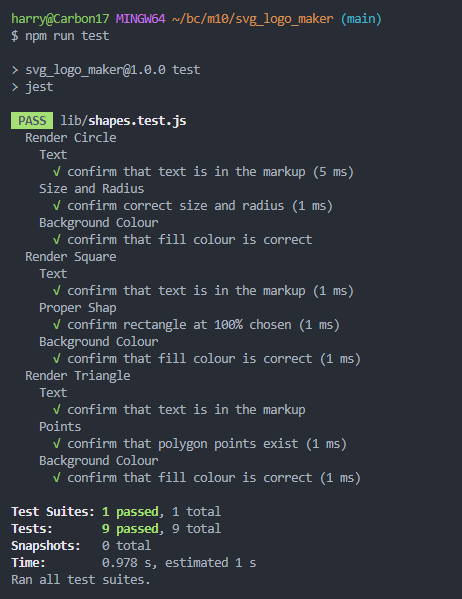
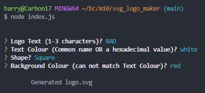

# SVG Logo Maker

## Description
This application allows the user to quickly make a logo with SVG technology.  The user can enter the shape, text, and colours for both.  The logo is then saved to "logo.svg" in the root project folder.

## Table of Contents
- [Installation](#installation)
- [Usage](#usage)
- [License](#license)
- [Contributing](#contributing)
- [Tests](#tests)
- [Questions](#questions)
- [Screenshots](#screenshots)
- [Video](#video)
- [GitHub Link](#github-link)

## Installation
1. "**Node.js**" must be installed on local machine.
2. Once in your project folder please type "**npm i -y**" for all dependencies.

## Usage
To use the application, enter "**node index.js**" in a CLI of your choosing.
Note: Common colours are included but must be spelled correctly.
After all questions are answered see the generated file "logo.svg" in root folder.

## License
This application is licensed by: [MIT](https://opensource.org/licenses/MIT)

## Contributing
You may 'fork' the project in the github repository.

## Tests
In Bash Console enter "**npm run test**".

## Questions
If you have any questions, please contact:
-- (https://github.com/harrymac1972)
-- harrymac1972@gmail.com.

## Screenshots

## Video
<a href="https://drive.google.com/file/d/17Vhp4nK8DVYRAZOYTwhUKFGuwyhwKiIt/view">Demonstration Video</a>

## GitHub Link
<a href="https://github.com/harrymac1972/svg_logo_maker">SVG Logo Maker</a>

